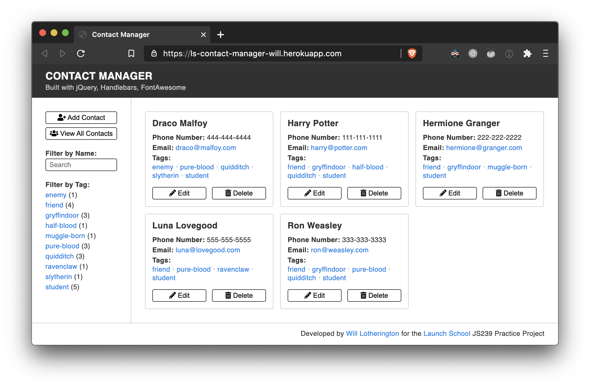
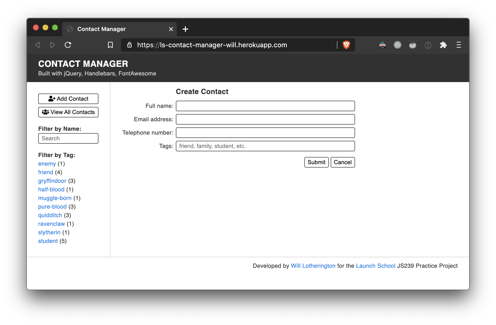
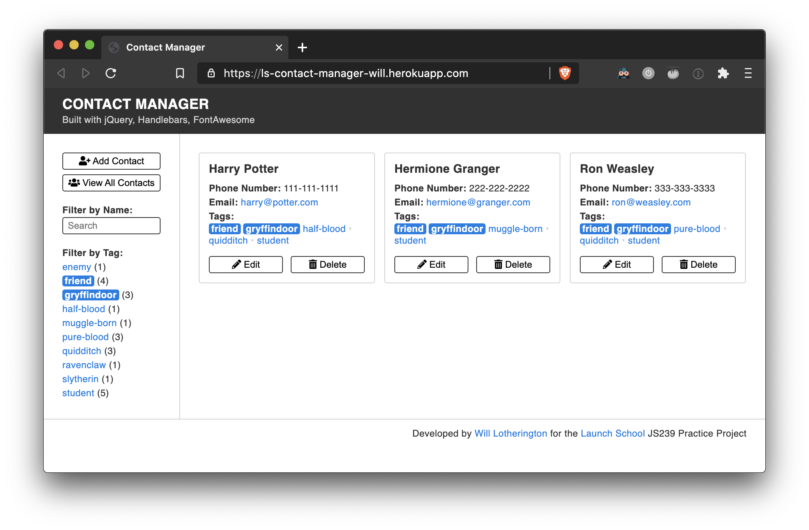

# Contact Manager

* **Try it out:** [https://contact-manager-wlotherington.herokuapp.com/](https://contact-manager-wlotherington.herokuapp.com/)
* **Stack:** `node`, `JavaScript`, `jQuery`, `Handlebars`, `FontAwesome`
* **Feedback:** [Will.Lotherington@hey.com](mailto:will.lotherington@hey.com)

### What is it?
Simple filterable contact manager built with a node backend and JS/jQuery front end.



## Overview
### Contact manager application.
* Leverages a node API server to manage contact data
* Allows for adding, deleting, and filtering contacts
* Tags can be entered as comma seperated values
* Built using [jQuery](https://jquery.com/), [Handlebars](https://handlebarsjs.com/), [FontAwesome](https://fontawesome.com/)

### View All Contacts


### Add Contact


### Filter Contacts


## Improvement Opportunities
* Add form validation
* Check for redundant contacts
* allow tags to be upper and lower case
* allow for easier entering of existing tags
* Have the ```Contact``` object handle more of the flagging/unflagging for contact filtering
* Move ```Tag``` related methods (filtering, showing) to ```TagManager``` Object
* Move ```Contact``` related methods (filtering, delete, showing) to ```ContactManager``` Object

## Known Bugs
* Filtering by name shows blank screen if you type in invalid char sequence then click backspace
* If you are on the Add/Edit form screen and filter by tag or click the "view all contacts" button, nothing happens.